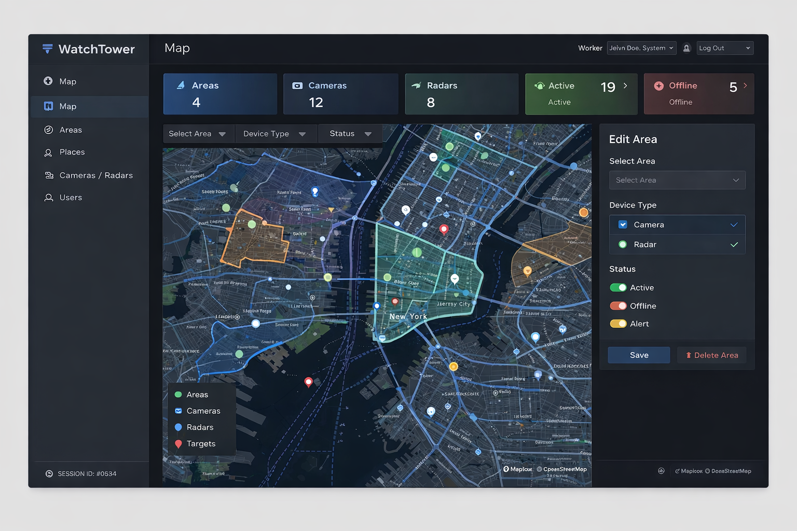

# 🛰️ WatchTower
### Map-Driven Surveillance Management System (Areas • Cameras • Radars • Targets • Users)

<p align="center">
  
  <br/>
  <i>One map to manage everything — areas, devices, targets, and access.</i>
</p>

<p align="center">
  <a href="#-features">Features</a> •
  <a href="#-screenshots">Screenshots</a> •
  <a href="#-tech-stack">TechStack</a> •
  <a href="#-security--permissions">Security</a> •
  <a href="#-run-locally">Run Locally</a>
</p>

---

## 🚀 Overview

**WatchTower** is a full-stack web platform for managing observation devices across large geographical regions.
Instead of tables and IDs, everything is **spatial**:

- **Areas** are polygons
- **Places** are points inside areas
- **Cameras/Radars** are deployed on places
- **Targets** are points of interest
- **Permissions** follow the map

This project was built to demonstrate real-world system design:
role-based authorization, spatial modeling, and a clean interactive UI.

---

## ✨ Features

- 🗺️ **Interactive map UI** (areas, devices, targets)
- 🧱 **Polygon-based area management**
- 📍 **Place creation** and device deployment
- 🎯 **Targets** + device assignment
- 👥 **Role-based access control** (User / Area Admin / System Admin)
- 🎛️ **Filters** by area, type, and status
- 🔐 **JWT authentication** + endpoint authorization

---

## 📸 Screenshots

### 🗺️ Main Map
<p align="center">
  
  <br/>
  <i>Main interactive map — polygons, device markers and targets.</i>
</p>

### 🧱 Area Management (Admin)
<p align="center">
  
  <br/>
  <i>Create/edit/delete areas and draw polygons directly on the map.</i>
</p>

### 📷 Devices (Cameras / Radars)
<p align="center">
  
  <br/>
  <i>Deploy devices, assign targets, and control active status.</i>
</p>

### 👥 Users & Permissions
<p align="center">
  
  <br/>
  <i>Assign roles and restrict visibility by user and by area.</i>
</p>

> Tip: Add a short demo GIF:
<p align="center">
  
</p>

---

## 👥 Roles & Permissions

- **User**: view only devices assigned to them / their areas
- **Area Admin**: manage devices & assignments inside their areas
- **System Admin**: full control (areas, users, roles, devices)

Permissions are enforced in:
- ✅ Frontend (UI guards)
- ✅ Backend (role-based authorization on endpoints)

---

## 🏗️ TechStack

**Frontend**
- React (SPA)
- Leaflet map integration
- Role-aware UI guards

**Backend**
- .NET Core Web API
- Entity Framework Core
- JWT Authentication + Role-Based Authorization
- SQL Database (Docker-ready)

---

## 🔒 Security & Permissions

- JWT-based authentication
- Password hashing with salt
- Authorization on every endpoint
- Separation between “view” and “manage” operations

---

## 🧪 Run Locally

### Backend
```bash
cd Backend
dotnet restore
dotnet ef database update
dotnet run
```

### 🎨 Frontend Setup

#### 📦 Install Dependencies

```bash
cd Frontend
npm install

▶️ Run Development Server
npm run dev


The frontend will be available at:  http://localhost:5173
```